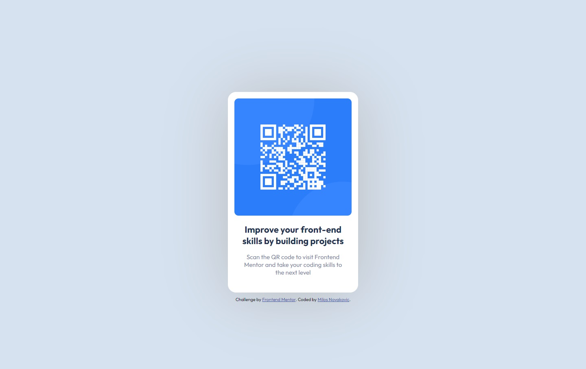

# Frontend Mentor - QR code component solution

This is a solution to the [QR code component challenge on Frontend Mentor](https://www.frontendmentor.io/challenges/qr-code-component-iux_sIO_H). Frontend Mentor challenges help you improve your coding skills by building realistic projects. 

## Table of contents

- [Overview](#overview)
  - [Screenshot](#screenshot)
- [My process](#my-process)
  - [Built with](#built-with)
  - [What I learned](#what-i-learned)
  - [Continued development](#continued-development)
  - [Useful resources](#useful-resources)
- [Author](#author)

## Overview

### Screenshot
<div>
  
  
</div>

## My process

### Built with

- Semantic HTML5 markup
- CSS custom properties
- Flexbox
- Mobile-first workflow
- REM (Root EM)

### What I learned

During the development of this challenge, you get to know the structure of your website - what tags you should use to create the given design. In this projects were used both inline and block elements such as:
  div - block element
  ```html
  <div class="main-div">
  ```
  or
  img - inline element
    ```html
  
    ```.

Along with HTML for structure, there is CSS for formatting. The context of CSS file is composed of:
  Google Fonts import
  ```css
  @import url('https://fonts.googleapis.com/css2?family=Outfit:wght@400;700&display=swap');
  ```
  custom CSS properties
  ```css
  :root {
      --White: hsl(0, 0%, 100%);
      --Lightgray: hsl(212, 45%, 89%);
      --Grayish-blue: hsl(220, 15%, 55%);
      --Dark-blue: hsl(218, 44%, 22%);
      --attribution-link-color: hsl(228, 45%, 44%);
  }
  ```
  boilerplate 
  ```css
  * {
      margin: 0;
      padding: 0;
      box-sizing: border-box;
      font-family: 'Outfit', sans-serif;
  }
  ```
  css rules for HTML elements
  ```css
  img {
      width: 100%;
      height: auto;
      border-radius: 10px;
  }
  ```

### Continued development

In order to make control over HTML elements on the page, it is desirable to use Flexbox or Grid. 
Staying focused on the relations between elements and both HTML and CSS organization. 

### Useful resources

- [HTML](https://www.w3schools.com/html/default.asp) - For understanding basic concepts of the HTML and CSS. This is really helpful if you came across with some term that you are not familiar with.
- [MDN Web Docs](https://developer.mozilla.org/en-US/docs/Web/HTML/Element/footer) - Another great resource with a lot of useful informations and examples. It is an open-source that also provide an extensive set of learning resources for beginning developers and students.
- [CSS-TRICKS](https://css-tricks.com/snippets/css/a-guide-to-flexbox/) - Useful for understanding a lot of CSS-related topics, including Flexbox.
- [freeCodeCamp](https://www.freecodecamp.org/news/what-is-rem-in-css/) - Best website are the one that provide more possibilities for clients to use them. It includes taking care about the font-size that client will set. To provide that, it's better using relative units rather than absolute. 

## Author

- GitHub - [MiloosN5](https://github.com/MiloosN5)
- Frontend Mentor - [@MiloosN5](https://www.frontendmentor.io/profile/MiloosN5)


